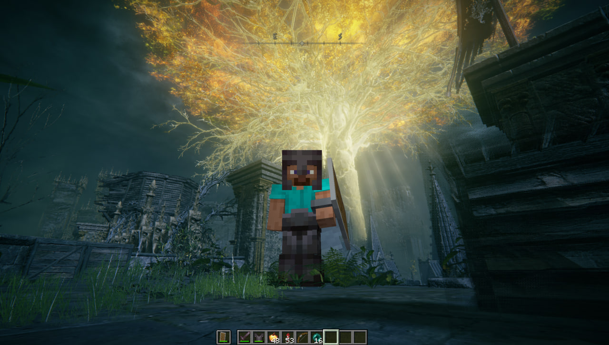

# Minecraft Ring



**Minecraft movement, building and combat in the Lands Between.**

[](#requirements)
[](#requirements)
[](CHANGELOG.md)
[](LICENSE)

Minecraft Ring runs real Minecraft Java Edition alongside Elden Ring. Explore
with Minecraft's controls, bring your inventory and skin, build in Elden Ring's
world, and fight its enemies with Minecraft weapons. Elden Ring keeps running
its own world, characters, interactions and saves.

A native Windows bridge and a Fabric mod connect the games. Minecraft handles
the player and blocks; Elden Ring draws the combined scene, including Minecraft's
hand, character and HUD. Both games stay running throughout a session.

> **Experimental Windows port.** Local gameplay has been tested, but terrain,
> transitions, moving platforms and rendering still have rough edges. The
> supported setup is offline single-player on the game versions below.

[Setup guide](docs/installation.md) · [Development and diagnostics](docs/development.md) ·
[Changelog](CHANGELOG.md) · [Report an issue](https://github.com/siddoff/Minecraft-Ring/issues)

## What works

- **Movement and camera.** Walk, sprint, jump, crouch and fly with Minecraft
  controls. First-person and both third-person views show Minecraft's player
  inside Elden Ring.
- **Building.** Place and break Minecraft blocks, use your inventory and keep
  your builds in the local bridge world. Host terrain is represented by
  invisible collision blocks; Elden Ring's ground itself cannot be mined.
- **Combat.** Elden Ring enemies have Minecraft hitboxes. Melee attacks,
  projectiles and explosions send damage to the host game; enemy hits and status
  damage reach Minecraft in survival mode. Death and recall connect back to
  Elden Ring's respawn at a Site of Grace.
- **Native interactions.** Use doors, levers, items and Sites of Grace with R.
  Punching breakable Elden Ring props forwards an attack and refreshes nearby
  collision.
- **Terrain and passages.** Native collision rays build the walkable surface.
  Nearby detail sampling refines narrow arches and angled walls, refreshes
  opened doors, and samples ahead as you move.
- **Lifts and platforms.** Moving-floor detection supports boarding, vertical
  travel, jumping and landing, including gently sloped platforms and partial
  contact at an edge. Support tracking runs separately from terrain sampling.
- **Rendering.** Minecraft content is composited into Elden Ring's D3D12 frame
  with host depth occlusion. Shared GPU textures are used when supported, with
  a memory transfer fallback. The bridge manages its own borderless input window.
- **Control switching.** F8 hands camera and controls to Elden Ring for its
  menus and normal gameplay. Press it again to return to Minecraft.

## What's new in 0.3.0

Terrain collision now uses predictive passage refinement and reuses verified
clearance to reduce generation overhead. Minecraft weather and time commands
control Elden Ring's world while preserving native scripted events.

The Windows overlay improves focus, Alt+Tab and F8 switching, restores the
native cursor in Minecraft menus, and keeps loading screens transparent.
See the [changelog](CHANGELOG.md) for the full list.

## Requirements

| Component | Supported setup |
| --- | --- |
| Operating system | Windows x64 |
| Elden Ring | App Ver. **1.17.1**, executable **2.7.1.0**; other builds are unverified |
| Minecraft | Java Edition **1.21.1** |
| Fabric Loader / API | **0.19.5** / **0.116.17+1.21.1**, pinned in the project |
| Build tools | Python 3, LLVM-MinGW, **JDK 25**, **Gradle 9.7.1** |
| Hardware | Enough CPU, GPU and RAM to run both games together; the launcher gives Minecraft a 3 GB maximum heap |

You need your own copies of both games. Launch through the included scripts for
offline play: the loader requires the bridge launcher marker and refuses to
activate while Easy Anti-Cheat is present. Addresses and hooks target the listed
Elden Ring build.

## Getting started

The repository contains source and launch scripts. Toolchains and game
installations are obtained separately; there is no packaged installer yet.

1. Clone the project:

   ```powershell
   git clone https://github.com/siddoff/Minecraft-Ring.git
   cd Minecraft-Ring
   ```

2. Prepare the tools described in the [setup guide](docs/installation.md#toolchains),
   then build the native DLLs:

   ```powershell
   python tools/build_native.py
   ```

3. Close Elden Ring and install into the folder containing `eldenring.exe`:

   ```powershell
   powershell -NoProfile -ExecutionPolicy Bypass -File .\Install.ps1 -GameDir 'D:\SteamLibrary\steamapps\common\ELDEN RING\Game'
   ```

   Replace the example path with yours. The installer backs up Elden Ring saves
   and moves recognized existing mod files into the project's `backups/` folder.

4. Double-click **start.bat** or **Play.bat**. Once the bridge is ready, choose
   **Continue** in Elden Ring. The launcher builds and starts Minecraft, which
   opens its bridge world automatically.

Minecraft stays windowed; the bridge aligns its borderless input window with
Elden Ring. Keep the launcher console open while playing. The first bridge world
starts in creative mode. Use `/gamemode survival` to take enemy damage, or
`/gamemode creative` to switch back.

## Controls

| Input | Action |
| --- | --- |
| WASD / mouse / Space / Shift | Move / look / jump / crouch |
| Left / right mouse button | Attack or break / use or place |
| E | Minecraft inventory |
| F5 | Cycle first-person and third-person views |
| R | Elden Ring interaction: doors, levers, items and Sites of Grace |
| F8 | Switch control between Minecraft and Elden Ring |
| T / / | Minecraft chat / commands |

Release F8 between presses. In Elden Ring mode Minecraft pauses and hides; the
next press returns it to the Tarnished's position. F6 toggles compositing, F7
switches camera mode, F9 shows diagnostics, and F10 toggles the hidden Tarnished
stand-in. Those are development controls; the normal setup uses compositing and
Minecraft-driven movement.

## Known limitations

- Terrain is sampled as you explore. Distant geometry, fast travel, narrow
  passages and platform edge cases need wider gameplay testing.
- GPU sharing and window transparency depend on the graphics driver. The memory
  fallback adds transfer overhead; frames support sizes up to 3840 × 2160.
- Other Elden Ring builds and combinations with other mods are unverified.
- Multiplayer is unverified; the current supported workflow is single-player.
- Setup uses a fixed local toolchain layout and a Gradle development client.
  Automatic tool installation and a portable release are still outstanding.

For startup or rendering problems, see [troubleshooting](docs/installation.md#troubleshooting).
Use the [issue forms](https://github.com/siddoff/Minecraft-Ring/issues/new/choose)
for bugs, feature requests and setup questions; English and Russian are welcome.
The [issue guide](docs/issues.md) explains automatic labels and useful report details.
To disable the bridge, close Elden Ring and run `Restore.ps1`; it restores the
previously moved mod files. Save backups are kept for manual recovery.

## Project and credits

The [native bridge and Fabric mod](bridge-base/elden-ring/README.md) live under
`bridge-base/elden-ring/`. Windows build and diagnostic helpers are in `tools/`.
The [development guide](docs/development.md) covers the protocol, regression
checks and local data paths.

Based on [minecraft-crossover-bridge](https://github.com/justbustin/minecraft-crossover-bridge)
by **justbustin**, with Windows adaptation and integration by **siddoff**.
[SkyCraft](https://github.com/chasmlol/SkyCraft) and
[ArkWeb](https://github.com/luki-1/ArkWeb) informed the architectural research
and presentation of the project.

Bridge code is available under the [MIT License](LICENSE). Bundled code and
dependencies are covered in [third-party notices](THIRD_PARTY_NOTICES.md).
Minecraft Ring is an unofficial fan project, unaffiliated with Mojang,
Microsoft, FromSoftware or Bandai Namco. Game files and saves are not distributed.
